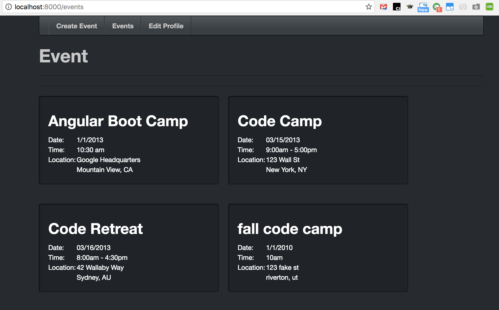
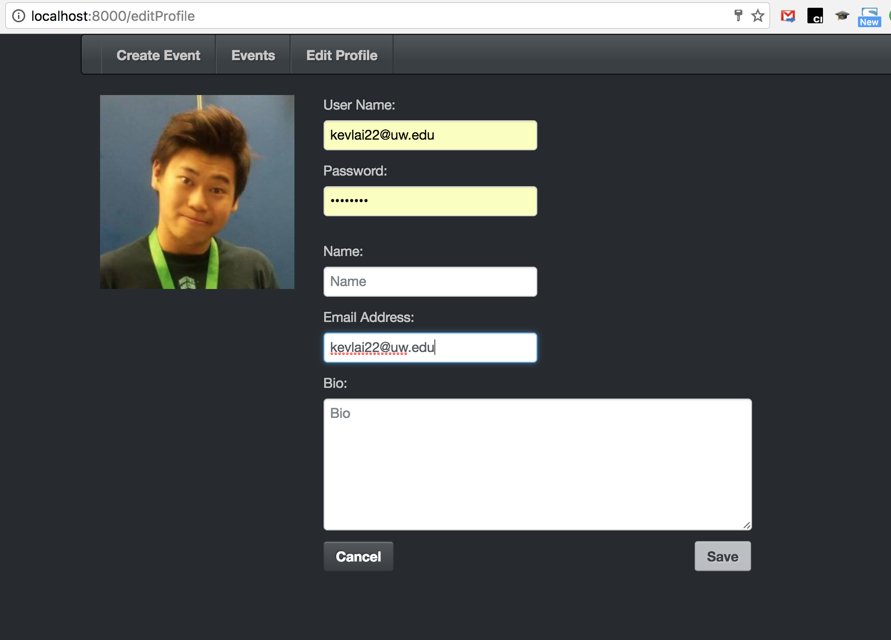
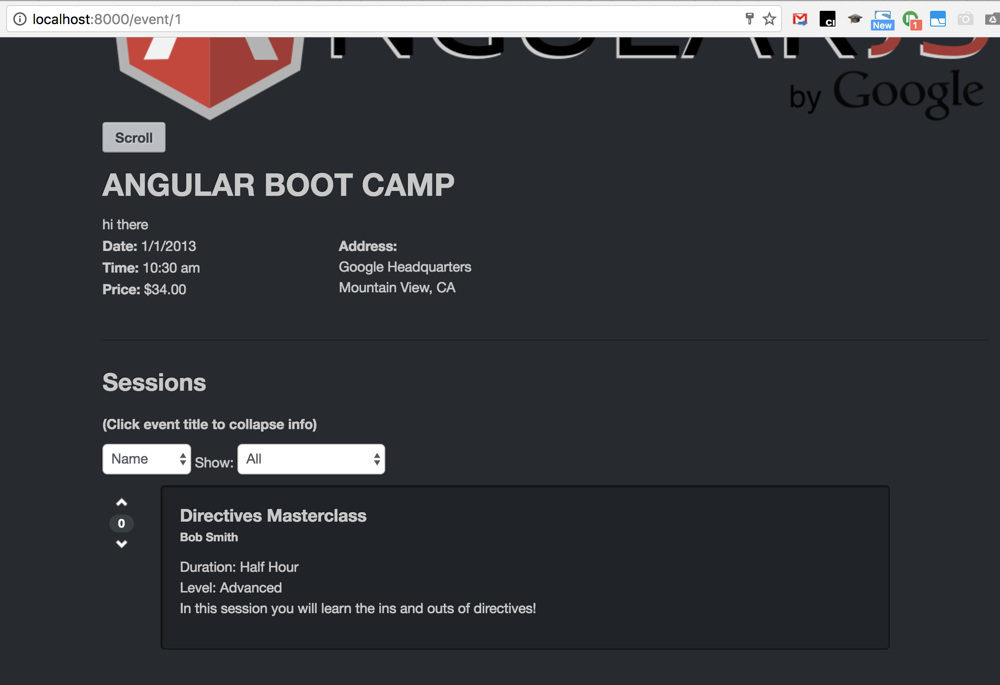
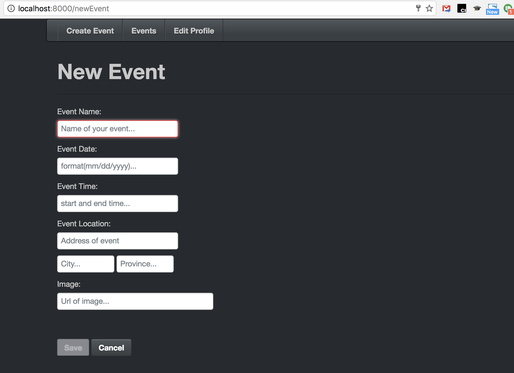

# Angular Event Registration Sample Website

This project is a sample application demonstrating a more fully developed realistic single page
angular application.

### Features:
- This is a maintainable and testable single page application created using AngularJS.
- Lots of AngularJS markup and expressions, controllers, built-in and custom services, and custom elements and directives are used and created.
- A bunch of tests are also written using Karma.
- End-to-end testing is conducted with Protractor

### Screenshots:
##Screenshots:

### Server:

A node server is provided, run "npm install" and then either "server.sh" from the command line if you are on a linux box or "server.bat" if you are on a windows box.

### Running the application:

Navigate your browser to `http://localhost:8000/` to see the app running in your browser. You may have to add the page to the url such as CompileSample.html if you wanna check out some sample pages I madde, which are not related to the event registration but demostrating different directives of Angular.

